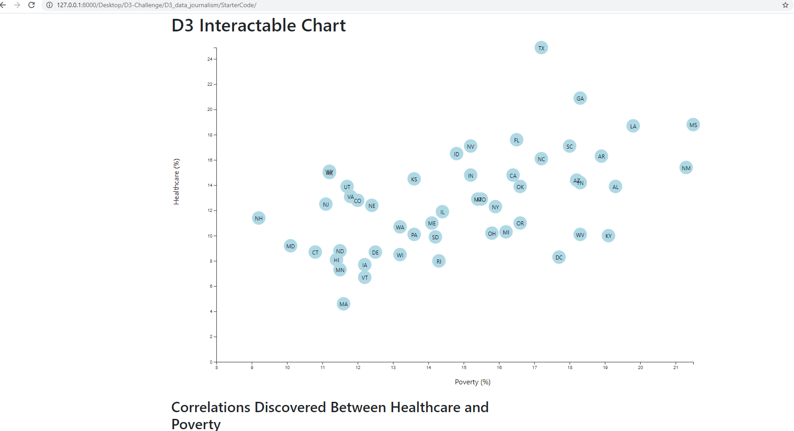
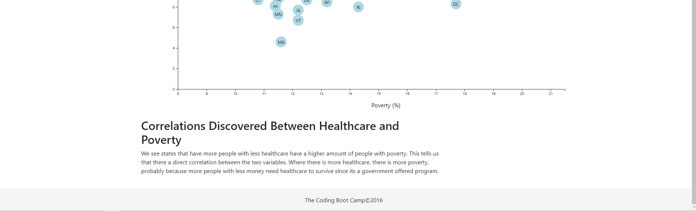

# D3 Homework - Data Journalism and D3

# My summary of this homework experience:

In this homework we used d3 to traverse through data, and create some really cool scatter charts to display it.
We displayed each point as a circle with a tooltip on each point showing the data values of the x and y axis. Another
bonus we could do was try to configure the chart where the axis titles were clickable to modify the scatter data set based
on what x and y values there were. I attempted to do that, but could not as it was too difficult. I hope I can come back to this
homework later on in the class and have an attempt to finish that bonus part as it's really interesting to try. As for what I learned
from the dataset:

We see states that have more people with less healthcare have a higher amount of people with poverty. This tells us that there a direct correlation between the two variables. Where there is more healthcare, there is more poverty, probably because more people with less money need healthcare to survive since its a government offered program.

Images:

**Page 1**

 
 

**Page 2**

 
 

**Links**

[App logic](https://github.com/slobanwala1/D3-Challenge/blob/main/D3_data_journalism/StarterCode/assets/js/app.js)

[HTML/Index](https://github.com/slobanwala1/D3-Challenge/blob/main/D3_data_journalism/StarterCode/index.html)

**Thanks for the learning experience!**
